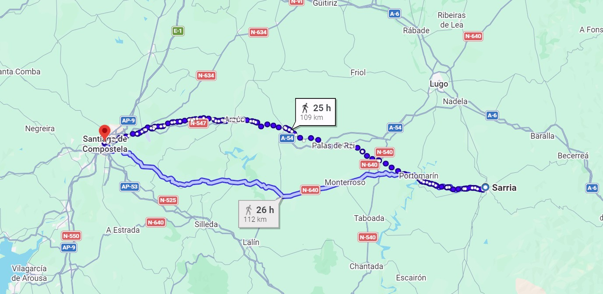

## Summary  
A realistic plan for **03–06 April** is a **short Camino “taster”**: fly/train from **Stuttgart or Nürnberg** to **Spain/Portugal**, walk **3–4 stages** on a well-serviced Camino section, stay in **albergues/pensions**, and carry a **light 25–35L pack** with rain-ready spring gear. Below are two strong route options (Spain + Portugal), plus logistics, accommodation strategy, packing list, and a day-by-day schedule.

---

## 1) First: What’s feasible in 4 days?
With only **03–06 April (4 days total)** and starting in Germany, you can typically:
- Use **Day 1** for travel + a short first walk (or arrival + overnight)
- Walk **Days 2–4** (2–3 full stages, depending on travel times)

**Best approach:** choose a Camino section with:
- **Easy access** (airport/train)
- **Dense accommodation**
- **Good waymarking**
- **Stage lengths you can adapt**

---

## 2) Recommended route options (pick one)

### Option A (Spain): **Camino Francés – Sarria → Santiago** (popular, easiest logistics)
)
**Why this is ideal for 4 days:**  
- Very frequent accommodation, cafés, baggage transfer if desired  
- Excellent markings  
- Easy access via **Santiago / A Coruña** airports + train/bus to Sarria  
- April: mild but can be **wet and cool** in Galicia

**Typical stages (classic 5–6 walking days from Sarria):**  
To fit 4 days total, you’ll likely walk **3 stages** and finish near/at Santiago, or walk faster/longer days.

**Suggested 3-stage plan (moderate):**
- **Sarria → Portomarín** (~22 km)
- **Portomarín → Palas de Rei** (~25 km)
- **Palas de Rei → Arzúa** (~29 km)  
Then on the 6th: travel / optional short walk (or earlier finish by longer days)

**Suggested 3-stage plan (more ambitious, aims to reach Santiago):**
- **Sarria → Portomarín** (~22 km)
- **Portomarín → Melide** (~35 km, long but doable for fit hikers)
- **Melide → Santiago** (~53 km, too long for most in one day)  
So for most groups, reaching Santiago within the 4-day window is tight unless:
- You add a **very early start + long days**, or
- You treat 03–06 as **walking days** and travel outside those dates, or
- You do **baggage transfer** and move faster.

**Verdict:** Best if you want the “Camino feel” with minimal risk/logistical friction.

---

### Option B (Portugal/Spain): **Camino Portugués – Tui → Santiago** (excellent 4-day fit)
**Why this is ideal for 4 days:**  
- **Perfect 4-stage itinerary**  
- Access is easy via **Porto** or **Santiago**  
- Scenic, great infrastructure, less crowded than Sarria (though still popular)

**Classic 4 stages (very workable):**
1. **Tui → O Porriño** (~16–19 km)  
2. **O Porriño → Redondela** (~15–16 km)  
3. **Redondela → Pontevedra** (~18–20 km)  
4. **Pontevedra → Caldas de Reis** (~21–23 km)  

If you want to end in Santiago within the window, continue:
5. **Caldas → Padrón** (~18–19 km)  
6. **Padrón → Santiago** (~24–26 km)  

So **03–06** can cover **4 stages comfortably**, but reaching Santiago typically needs **5–6 stages** from Tui. Still, it’s one of the best “short Camino” sections.

**Verdict:** Best balance of stage lengths + enjoyment + realistic pacing in 4 days.

---

## 3) Travel logistics from Stuttgart / Nürnberg

### Getting there (fastest general approach)
- **Fly to Porto (OPO)** or **Santiago de Compostela (SCQ)**  
- Then continue by **train/bus** to the start town

**For Option B (Tui start):**
- Fly to **Porto (OPO)**  
- Continue to **Valença (Portugal)** by train (common), then walk across the bridge to **Tui (Spain)**  
  - Valença ↔ Tui are neighboring border towns

**For Option A (Sarria start):**
- Fly to **Santiago (SCQ)**  
- Train/bus to **Sarria** (often via Lugo, depending on connections)

### Return
- From Santiago: fly out of **SCQ** (often easiest)  
- Or train/bus to **Porto** / **A Coruña** and fly from there

**Practical note:** Flight times and connections can strongly affect whether you can walk on 03 April. If you share your **preferred departure time range**, I can refine the day-by-day schedule.

---

## 4) Day-by-day plan (template for 03–06 April)

Below are two complete, workable templates—one for each recommended option.

---

# Plan Template 1 (Recommended): Camino Portugués (Tui area) – 4 walking days

## Day 1 – 03 April: Arrival + short walk
**Route:** Arrive Porto → Valença/Tui → walk to **O Porriño**  
- Travel: Germany → Porto  
- Transfer: Porto → Valença → Tui  
- Walk: **Tui → O Porriño (~16–19 km)**

**Overnight:** O Porriño  
- Stay type: **albergue** (pilgrim hostel) or **pensión/hotel**  
- Booking: in April, weekends can fill; consider **booking 1–2 nights ahead**

## Day 2 – 04 April
**Route:** **O Porriño → Redondela (~15–16 km)**  
- Easy day, good recovery after travel day

**Overnight:** Redondela

## Day 3 – 05 April
**Route:** **Redondela → Pontevedra (~18–20 km)**  
- One of the nicest stretches; great old town at the end

**Overnight:** Pontevedra (many options)

## Day 4 – 06 April: Walk + return travel (or extra night)
**Route:** **Pontevedra → Caldas de Reis (~21–23 km)**  
Then either:
- **Return travel** from nearby connections (typically you’d continue to Santiago later), or  
- Take bus/train back toward **Vigo/Porto/Santiago**, depending on flights

**Overnight (optional):** Caldas de Reis (if you travel next morning)

---

# Plan Template 2: Camino Francés (Sarria) – classic but finish is tight in 4 days

## Day 1 – 03 April: Arrival + start
**Route:** Arrive Santiago → transfer to **Sarria** → optional short walk  
- If arrival is early: walk **Sarria → Morgade / Ferreiros area (10–15 km)**  
- If arrival is late: sleep in Sarria and start next morning

**Overnight:** Sarria or along the route

## Day 2 – 04 April
**Route:** to **Portomarín** (~22 km from Sarria)

**Overnight:** Portomarín

## Day 3 – 05 April
**Route:** **Portomarín → Palas de Rei** (~25 km)

**Overnight:** Palas de Rei

## Day 4 – 06 April
**Route:** **Palas de Rei → Arzúa** (~29 km)  
- You’ll be ~40 km from Santiago; not enough time to finish unless you add another day or push very long distances.

---

## 5) Accommodation strategy (albergue vs pension)
### Albergues (pilgrim hostels)
**Pros:** social, inexpensive, Camino atmosphere  
**Cons:** shared rooms, sometimes no reservations, can fill up

### Pensions/Hotels
**Pros:** better sleep, private room, easier logistics  
**Cons:** higher cost, slightly less “pilgrim vibe”

**Recommendation for April:**  
- Mix: **albergue + private room when needed**  
- If you want low-stress: **book first night + last night**, keep mid-nights flexible.

---

## 6) Camino essentials: documents & navigation
- **Credencial (Pilgrim Passport):**  
  - Needed for albergues and stamps (“sellos”)  
  - Buy from Camino associations, some hostels, cathedrals, or in start towns
- **ID/Passport**, **EHIC** (European Health Insurance Card), travel insurance  
- **Offline maps:** Buen Camino / WisePilgrim / Maps.me  
- **Cash:** small towns sometimes card-unfriendly

---

## 7) Packing list (April in Galicia: cool + rain likely)
Aim for **lightweight**. Target pack weight (without water): **6–9 kg**.

### Backpack & carrying
- 25–35L backpack + rain cover  
- 1–2 dry bags or pack liners (rain protection)

### Clothing (layering)
- Waterproof rain jacket (real hiking shell)  
- Light insulated layer (fleece or light puffy)  
- 2 quick-dry shirts (1 worn, 1 spare)  
- 1 hiking pants + optional lightweight rain pants  
- 2–3 pairs hiking socks (merino/synthetic)  
- Underwear (2–3)  
- Hat/cap + thin gloves (mornings can be chilly)

### Footwear
- Trail runners or light hiking shoes (already broken in)  
- Optional: lightweight sandals/flip-flops for evenings

### Sleeping & hygiene
- Sleeping bag liner (most albergues provide blankets; liners are common)  
- Small microfiber towel  
- Earplugs + sleep mask (shared dorms)  
- Basic toiletries + blister care

### Safety & first aid (must-have)
- Blister kit: **Compeed**, tape (Leukotape), small scissors  
- Disinfectant wipes, a few plasters, pain relief you tolerate  
- Sunscreen (yes, even in April) + lip balm  
- Personal meds

### Trekking comfort
- Trekking poles (very helpful in rain/mud and for knees)  
- 1–1.5L water capacity (bottles or bladder)  
- Headlamp (useful in early starts)  
- Phone charger + small power bank

---

## 8) Daily routine & pacing (practical guide)
- Start walking **08:00–09:00** (earlier if you want albergue beds without booking)  
- Plan **3–5 km/h** including short breaks  
- Typical café stop every **5–10 km** in popular sections  
- Foot care: address hot spots immediately (tape early)

---

## 9) Weather considerations (early April)
- Expect **rain, wind, and 5–15°C** swings  
- Trails can be muddy; prioritize:
  - waterproof outer layer
  - quick-dry clothing
  - keeping spare clothes dry in a dry bag

---

## 10) Questions to finalize your “comprehensive” itinerary
Reply with:
1. **How many people** and hiking experience level?
2. Do you want **to finish in Santiago** within 03–06, or is a “Camino section” enough?
3. Preferred comfort: **albergue / private rooms / mixed**?
4. Do you prefer **Portugal (Tui route)** or **Spain (Sarria route)**?
5. Will you travel on 03 and return on 06 (same days), or can travel happen **evening before / morning after**?

With those answers, I can produce a **final day-by-day schedule with exact towns, suggested lodging types, and transport connection strategy** from **Stuttgart or Nürnberg** (flight/train options and timing assumptions).
